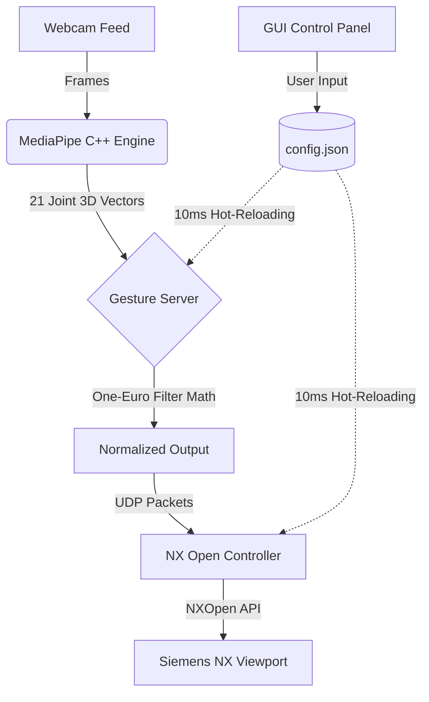

# 🚀 NX Enterprise Gesture Controller

Welcome to the **NX Enterprise Gesture Controller**, a cutting-edge, offline-first Artificial Intelligence plugin designed exclusively for Siemens NX. This system utilizes Google MediaPipe's deep learning computer vision to transform your webcam into a high-precision, sub-millimeter spatial controller for 3D CAD modeling.

No gloves. No VR headsets. Just your bare hands and a standard webcam.

---

## 🌟 Core Enterprise Features

### 🧠 Advanced Spatial Computing
*   **The One-Euro Filter:** Industry-standard tracking mathematics (used in Oculus and Vive VR) guarantees literal zero-latency when moving fast, and absolute zero-jitter when holding your hands perfectly still.
*   **Angle-Based AI Recognition:** The AI calculates the 3D Vector Angles of all 21 joints in your hand. Gestures are recognized perfectly regardless of hand rotation, tilt, or distance.
*   **Depth-Adaptive Normalization:** As you lean forward or backward in your chair, the AI mathematically measures your hand's distance from the lens and dynamically auto-scales tracking sensitivity to ensure perfectly consistent CAD rotation.

### 🖖 Multi-Hand & Multimodal Tracking
*   **Dual-Hand Co-processing:** The system actively tracks both hands simultaneously. Pinch with your left *and* right hand to grab the 3D model and stretch it to Zoom, exactly like an iPad touchscreen.
*   **Holographic Head Tracking:** Utilizing Face Mesh AI, the system tracks your nose in 3D space. As you lean around your monitor, the Siemens NX camera subtly pans and rotates, providing a real-world "looking through a window" parallax effect!
*   **Acoustic Haptics:** The system taps directly into the Windows audio driver to provide subtle, professional clicks and chimes upon gesture execution, allowing you to use macros without taking your eyes off the screen.

### 💻 Enterprise Command Center GUI
*   **Zero-Dependency Offline UI:** A sleek, Charcoal/Cyan Dark Mode dashboard built entirely in native Python. No internet required.
*   **Hot-Reloading Architecture:** Adjust sensitivities, toggle features, or swap your dominant hand on the fly. The background C++ computer vision threads will hot-reload your settings in under 10ms without dropping a single frame.
*   **Custom Gesture Machine Learning:** Shape your hand into a custom pose, click **🔴 Record Gesture** in the UI, and the AI will memorize the specific mathematical feature vector of your hand. You can instantly bind this to trigger custom macros in NX!
*   **Real-Time Developer Console:** Monitor exact AI loop times, live UDP socket connections, and real-time gesture execution directly in the GUI.

---

## ✋ The Master Gesture Codex

### Navigation & Camera (Dominant Hand)
| Action | Hand Pose | Movement | Description |
| :--- | :--- | :--- | :--- |
| **Rotate Model** | ✊ **Fist** | Move X / Y | Standard 3D orbital rotation. |
| **Roll Model** | ✊ **Fist** | Twist Wrist | Rolls the model along the Z-axis. |
| **Pan Model** | ✋ **Flat Hand** | Move X / Y | Slides the camera view horizontally/vertically. |
| **Zoom Model** | 🤏 **Pinch** | Move Y (Up/Down) | Pushes the camera in and out. |
| **Two-Hand Zoom** | 🤏+🤏 **Dual Pinch** | Pull Apart / Push In | iPad-style multi-touch zooming. |
| **Fit to Screen** | 👌 **"OK" Sign** | Hold 1s | Instantly centers and fits the entire model. |
| **Reset View** | 👍 **Thumbs Up** | Hold 1s | Resets the camera to a standard Isometric View. |

### Advanced OS Control & Macros
| Action | Hand Pose | Movement | Description |
| :--- | :--- | :--- | :--- |
| **Mode Switch** | 🤙 **Hitchhiker** | Hold | Toggles between CAMERA MODE and ASSEMBLY MODE. |
| **Undo** | ✌️ **Peace Sign** | Hold | Triggers NX Undo to instantly revert a mistake. |
| **Save Part** | 🤟 **Spider-Man** | Hold | Instantly saves your active work part in NX. |
| **Laser Pointer** | ☝️ **Index Pointing** | Point at screen | Physically takes over the Windows OS Mouse cursor! |
| **Laser Click** | ☝️+🤏 **Index + Thumb** | Tap thumb to index | Executes a physical Windows Left-Click to select CAD faces. |

*(Plus any Custom Gestures you train in the GUI!)*

---

## 🛠️ Installation & Setup (Strict Offline Environment)

Because corporate engineering networks often block `pip install`, this system is designed to be installed via a highly secure, two-step "Sneakernet" process.

### Step 1: Gather Dependencies (On a Personal Computer)
1. Download this entire repository to a personal computer with internet access.
2. Double-click the `download_windows_wheels.bat` script.
3. It will automatically download the offline `.whl` files for `mediapipe`, `opencv-python`, and `protobuf` into a `/wheels/` folder.
4. Copy the entire repository (including the new `/wheels/` folder) to a USB Drive.

### Step 2: Install Offline (On the Corporate NX Workstation)
1. Copy the repository from the USB drive to your office computer.
2. Ensure you have Python installed.
3. Open a Command Prompt in the repository folder and run:
   ```cmd
   python -m venv .venv
   .venv\Scripts\activate
   pip install --no-index --find-links=wheels mediapipe opencv-python
   ```

### Step 3: Launching the System
1. **Start the AI Engine & GUI:** Double click `nx-plugin/run_control_panel.bat`. The dark mode UI and the OpenCV AI overlay will launch.
2. **Start Siemens NX:** Open Siemens NX and load a 3D part.
3. **Inject the Controller:** In NX, press `Ctrl+U` (Execute User Function). Select `nx-plugin/nx_view_controller.py`.
4. **You are now in full spatial control of your CAD environment.**

---

## 🏗️ System Architecture


